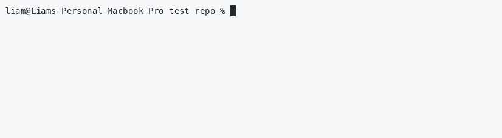

# gitflex

`gitflex` is a Git wrapper TUI for cleaning up old branches and making common branch operations faster in repositories with lots of local branches and worktrees.

Run `gitflex clean` to clear old branches, automatically selecting branches already merged into main/master or authored by others for deletion. Checked out branches are protected from deletion.



Run `gitflex switch/merge/rebase/delete` to perform the corresponding git operation. It provides a handy search feature in case you forgot the branch name


The commands also remember the last branch selected, showing it at the top of the list next time so you remember your rebase target


## Install

```sh
cargo install gitflex
```

Aliases make the commands convenient to use

```sh
alias gc='gitflex clean'
alias gs='gitflex switch'
alias gr='gitflex rebase'
alias gm='gitflex merge'
alias gd='gitflex delete'
```

`gitflex` also support directly specifying the branch name on the CLI, so you can reuse your shortcut alias like `gs main` (same as `gitflex switch main` which immediately switches to main)
